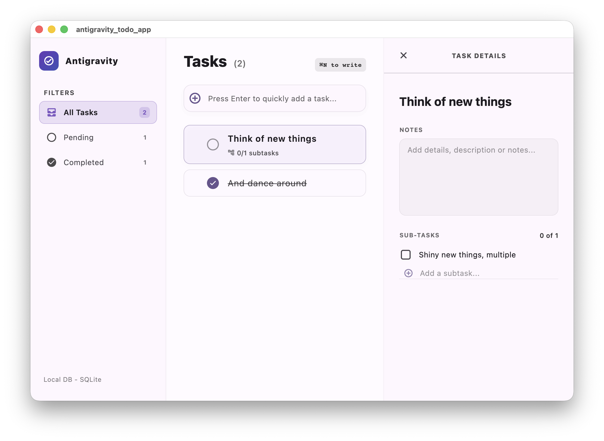

# Antigravity TODO App

Antigravity TODO is a desktop-first productivity application built with **Flutter** and **Material 3**. Designed specifically for macOS (and scalable to other platforms), it features a three-column layout, fluid drag-and-drop reordering, interactive subtask checklists, and seamless local persistence using **SQLite**.

State management is powered by **Riverpod** with modern annotations and code generation, ensuring clean, scalable, and reactive data flow.



---

## ✨ Features

- **📺 Premium Desktop Layout**: A beautiful, responsive three-column dashboard:
  - **Sidebar**: Translucent glassmorphic menu with real-time task counts across filters.
  - **Task Board**: Primary work area listing tasks with interactive complete buttons, custom hover states, and drag-and-drop handles for manual reordering.
  - **Detail Inspector**: A sliding side panel that reveals detailed notes and a subtask checklist for the selected task.
- **⚡ Keyboard-Driven Actions**:
  - `Cmd + N` (macOS) / `Ctrl + N` (Linux/Windows): Focuses the quick-add input immediately.
  - `Escape`: Deselects the active task and dismisses the Detail Inspector.
- **📝 Subtask Checklists**: Break down complex tasks into smaller subtasks, complete with status tracking and dynamic progress counters (e.g. `2/5 subtasks completed`).
- **💾 Auto-Save Detail Editor**: Modifying task titles or notes automatically updates and commits changes to the database as soon as the text fields lose focus (on-blur autosave).
- **🎨 Glassmorphism & Material 3 Styling**: Incorporates smooth gradients, micro-animations, background blurs (`BackdropFilter`), curated theme colors (`deepPurple` seed), and native light/dark mode support.
- **🔌 Offline-First Persistence**: Local database storage using SQLite (`sqflite`), including cascade-deletion for subtasks and database migrations for schema updates.

---

## 🏗️ Architecture & Project Structure

The project follows a modular layered architecture, separating concerns into clean folders:

```text
lib/
├── main.dart                  # App entry point, theme configuration, and main layout structure
├── models/
│   └── todo.dart              # Immutable data models for Todo and SubTask (w/ copyWith & Map converters)
├── services/
│   └── database_service.dart  # SQLite lifecycle, table schemas, and database CRUD query controllers
├── providers/
│   ├── todo_provider.dart     # Riverpod Notifiers for active filter, task selection, and CRUD list controller
│   └── todo_provider.g.dart   # Auto-generated Riverpod code-gen bindings
└── widgets/
    ├── sidebar.dart           # Glassmorphic sidebar containing the navigation filters
    ├── todo_list_view.dart    # Scrollable task list featuring quick-add, drag-reorder, and cards
    └── todo_detail_panel.dart # Sliding inspection panel for notes editing and subtask checklist
```

---

## 🗄️ Database Schema

The local SQLite database (`todos.db`) consists of two relational tables with an active foreign key constraint ensuring integrity:

### 1. `todos` Table
Stores primary tasks and their current states.
| Column | Type | Constraints | Description |
| :--- | :--- | :--- | :--- |
| `id` | `INTEGER` | `PRIMARY KEY AUTOINCREMENT` | Unique identifier for the task. |
| `title` | `TEXT` | `NOT NULL` | The task's headline. |
| `description` | `TEXT` | | Detailed notes or description. |
| `is_completed` | `INTEGER` | `NOT NULL` (0 or 1) | Task completion status. |
| `position` | `INTEGER` | `DEFAULT 0` | Order position for custom list drag-reordering. |

### 2. `subtasks` Table
Stores child checklist items belonging to a specific parent task.
| Column | Type | Constraints | Description |
| :--- | :--- | :--- | :--- |
| `id` | `INTEGER` | `PRIMARY KEY AUTOINCREMENT` | Unique identifier for the subtask. |
| `todo_id` | `INTEGER` | `NOT NULL`, `FOREIGN KEY REFERENCES todos(id) ON DELETE CASCADE` | Links to the parent task. Cascade deletes subtasks when a task is removed. |
| `title` | `TEXT` | `NOT NULL` | Checklist item name. |
| `is_completed` | `INTEGER` | `NOT NULL` (0 or 1) | Subtask completion status. |

---

## ⌨️ Shortcut Bindings

Efficiently navigate and control your workflow using built-in desktop keyboard shortcuts:

| Shortcut | Action | Description |
| :--- | :--- | :--- |
| `⌘ + N` (macOS)<br>`Ctrl + N` (Other) | **Quick Add Focus** | Focuses the task entry field at the top of the task list. |
| `Enter` (when typing) | **Submit Task** | Saves the task, resets input, and maintains focus to continue typing. |
| `Escape` | **Deselect / Close** | Clears task selection and closes the Detail Inspector panel. |

---

## 🚀 Getting Started

### Prerequisites

Make sure you have Flutter installed and configured on your system. Run `flutter doctor` to verify your environment.

### 1. Clone & Resolve Dependencies
Fetch the project and install all required package dependencies:
```bash
flutter pub get
```

### 2. Run Code Generation
The project utilizes modern `flutter_riverpod` code generation. Run the build runner to generate Riverpod providers:
```bash
flutter pub run build_runner build --delete-conflicting-outputs
```
*(Use `watch` instead of `build` if you plan to edit providers live during development: `flutter pub run build_runner watch --delete-conflicting-outputs`)*.

### 3. Run the App
Launch the app in development mode on your connected device or simulator (e.g., macOS desktop):
```bash
flutter run
```

---

## 🧪 Testing & Code Quality

Maintain codebase stability by running static analysis and unit tests:

- **Run Static Analysis**: Ensure code complies with styling standards and has no syntax or lint errors:
  ```bash
  flutter analyze
  ```
- **Run Unit Tests**: Run model serialization and copy logic tests:
  ```bash
  flutter test
  ```
